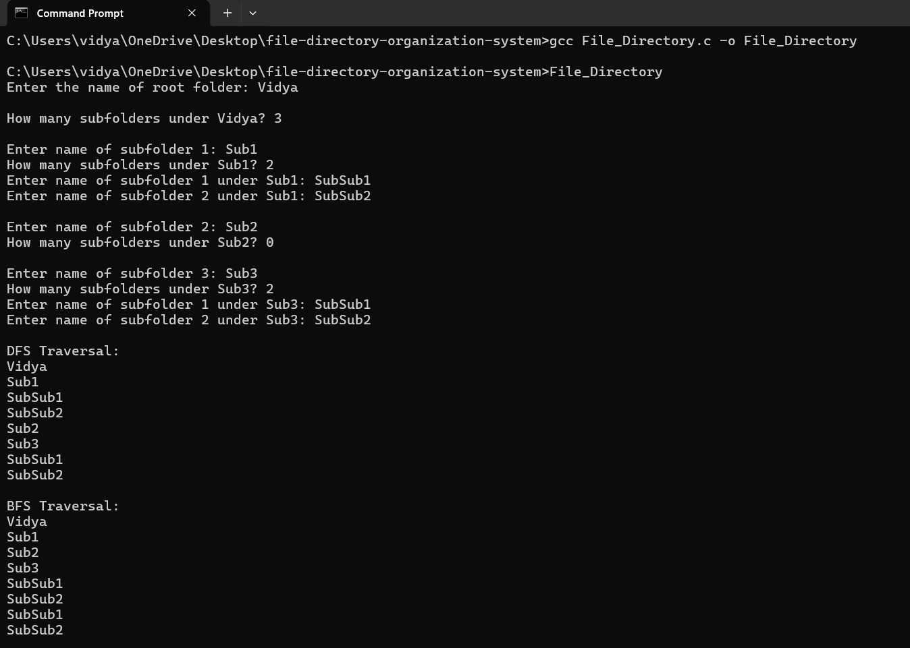

# File Directory Organization System

A C-based hierarchical file directory organization system using tree data structures, BFS, and DFS traversal.

## Overview

This project represents a file directory structure using a tree data structure. Each folder is represented as a node, and subfolders are represented as child nodes.

The program allows the user to create a root folder and add subfolders. It then displays the directory structure using Depth-First Search (DFS) and Breadth-First Search (BFS).

## Features

- Create a root directory
- Add subfolders
- Represent folders using a tree structure
- DFS traversal using a stack
- BFS traversal using a queue
- Dynamic memory allocation
- Parent-child relationships between folders

## Technologies Used

- C
- Data Structures
- Trees
- Stack
- Queue
- Pointers
- Dynamic Memory Allocation

## Data Structure

The project uses a tree structure where:

Root Folder
├── Subfolder 1
│   ├── Subfolder 1.1
│   └── Subfolder 1.2
│
└── Subfolder 2
    ├── Subfolder 2.1
    └── Subfolder 2.2

## Future Improvements
- Support unlimited directory levels
- Add folder search functionality
- Add folder deletion
- Display the complete directory tree
- Add file support
- Provide an interactive directory navigation system

## Author
Vidya Madabattula
## Demo

